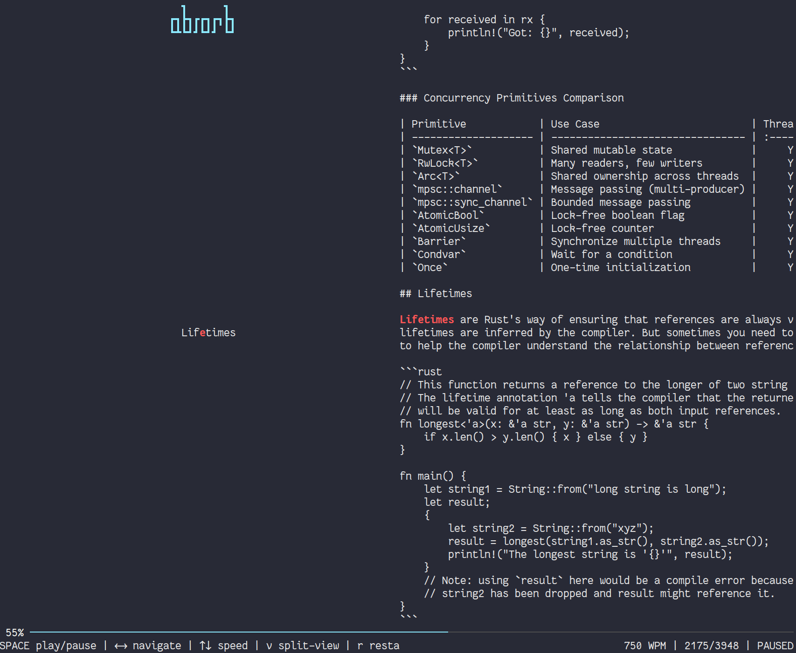

# absorb

Quickly read a file without moving your eyes.

## How it works

[RSVP](https://en.wikipedia.org/wiki/Rapid_serial_visual_presentation) displays one word at a time at a fixed point on screen. Each word is aligned on its **Optimal Recognition Point** (ORP) — the character your eye naturally fixates on — highlighted in red. This eliminates saccadic eye movements and lets you read significantly faster than traditional left-to-right scanning.

The reading speed eases in gradually over the first 10 words, starting at one third of your target WPM and ramping up smoothly. This gives your brain time to settle into the flow.

## Install

### Binaries

Check [Releases](https://github.com/kloki/absorb/releases) for binaries and installers

### crates.io

```bash
cargo install absorb --locked
```

## Usage

```bash
# Read a file
absorb document.txt

# Pipe text from stdin
cat article.md | absorb

# Set speed to 400 words per minute
absorb -w 400 document.txt

# See options
absorb --help
```
